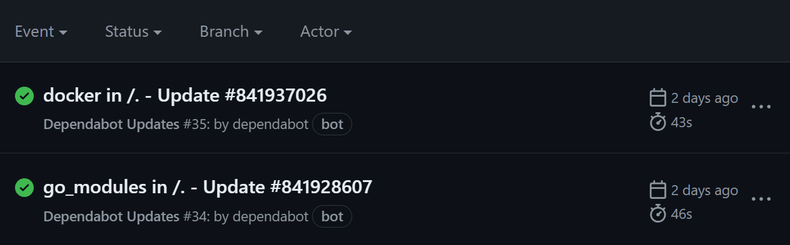
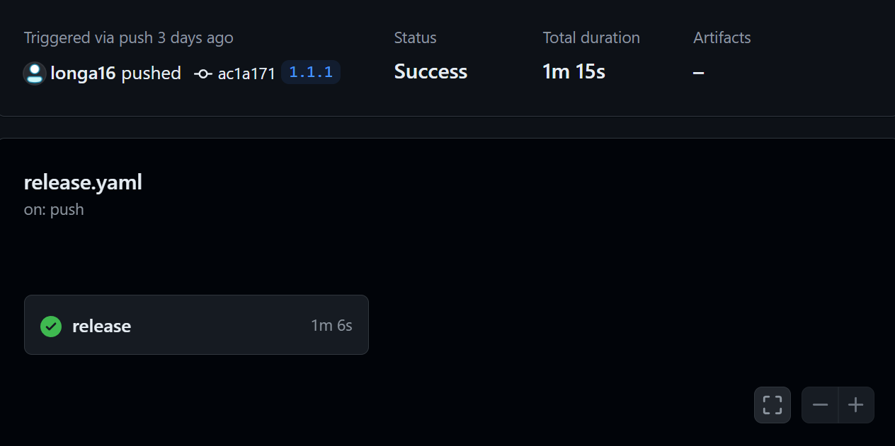
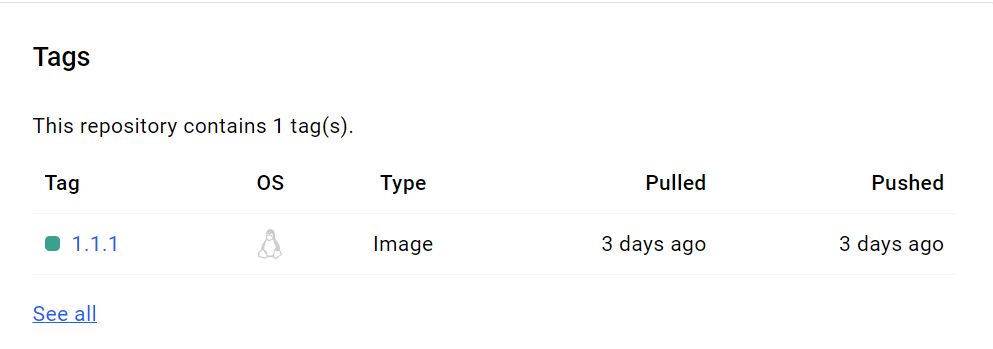
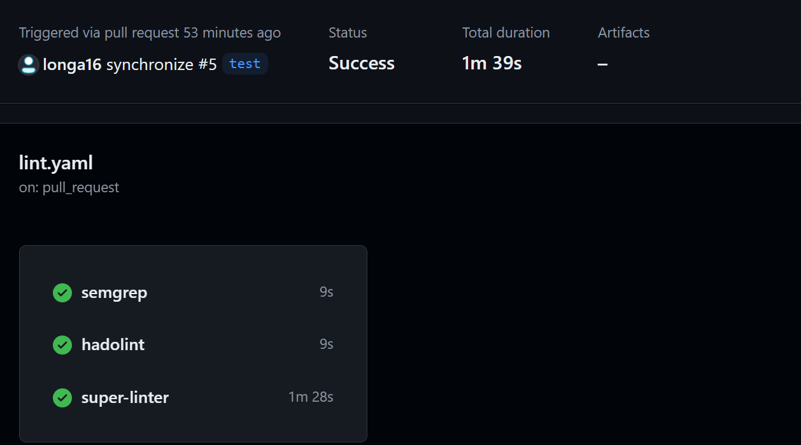
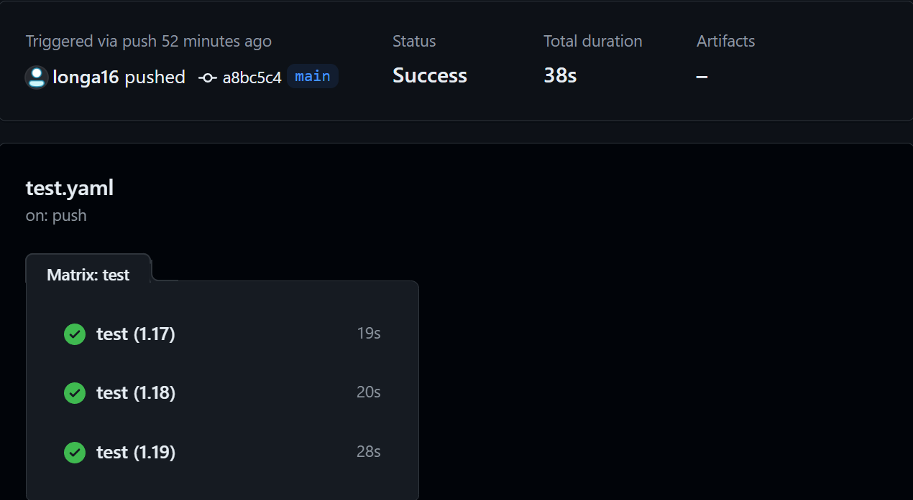

# Simple calculator

This is a simple calculator made in go !

It supports :

- division
- multiplication
- addition
- subtraction

## Usage example

```text
This is a simple calculator application.
It supports Addition, Subtraction, Division, Multiplication.
Specify the numbers to use with --x or --y.
Default values for x and y are 0.

Usage:
  calculator [command]

Available Commands:
  add         Addition of x and y
  completion  Generate the autocompletion script for the specified shell
  div         Division of x and y
  help        Help about any command
  mul         Multiplication of x and y
  sub         Subtraction of x and y

Flags:
  -h, --help     help for calculator
  -t, --toggle   Help message for toggle

Use "calculator [command] --help" for more information about a command.
```

## Example usage

### Addition

```bash
./calculator add --x 5 4
4.000000 + 5.000000 = 9.000000
```

### Subtraction

```bash
./calculator sub --x 5 4
4.000000 - 5.000000 = -1.000000
```

### Multiplication

```bash
./calculator mul --x 5 4
4.000000 * 5.000000 = 20.000000
```

### Division

```bash
./calculator div --x 5 4
4.000000 / 5.000000 = 0.800000
```

## Test execution

This application uses the default go test integration.

```text
> go test ./...
?       calculator                  [no test files]
?       calculator/cmd              [no test files]
ok      calculator/internals/math   0.002s
```

## GitHub Action 

It enables developers to automate common tasks 
in the software development lifecycle.

### Dependency management

install dependabot and configure it to activate and check go and
docker



###  Release workflow
This workflow is triggered when labels are created. It uses goreleaser to compile the project for different operating systems and integrate it into release artifacts.
the project for different operating systems and integrate it into the release artifacts.
This workflow also creates an image using the root Dockerfile and
and sends it to the docker hub.




###  Lint workflow

it  run several jobs: 
- a static analysis with semgrep
- a Dockerfile analysis with hadolint
- a super-linter execution, only if the event comes from a pull_request



###  Test workflow

This workflow is triggered for each push event and aims to execute the unit tests of
the project.




